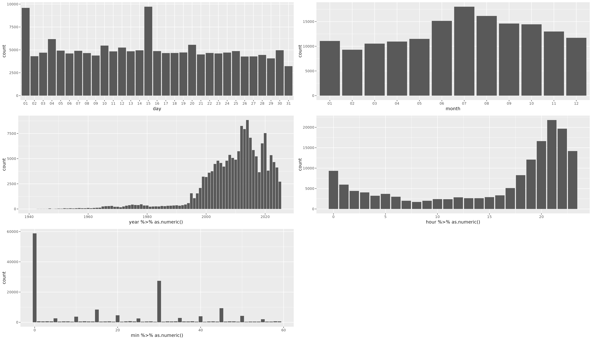
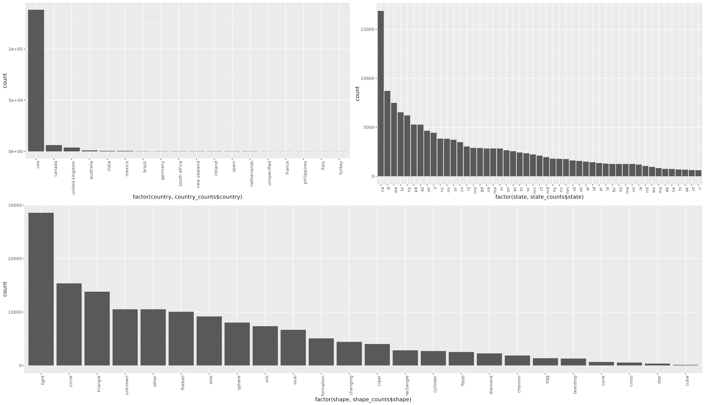

Basic Information about the NUFORC Data Set
===========================================
We begin with 156711 rows with columns id, link_url, occurred, city, state, country, shape, summary, reported, has_image, explanation.

1. id (0 NA) with 156711 unique values (eg. 111,
	113,
	114)
2. link_url (0 NA) with 156711 unique values (eg. https://nuforc.org/sighting/?id=1000,
	https://nuforc.org/sighting/?id=10000,
	https://nuforc.org/sighting/?id=100000)
3. occurred (299 NA) with 134473 unique values (eg. 11/07/2015 18:00,
	07/04/2014 22:00,
	07/04/2010 22:00)
4. city (823 NA) with 31885 unique values (eg. Phoenix,
	Seattle,
	Portland)
5. state (9105 NA) with 976 unique values (eg. CA,
	FL,
	WA)
6. country (0 NA) with 406 unique values (eg. USA,
	Canada,
	United Kingdom)
7. shape (6343 NA) with 40 unique values (eg. Light,
	Circle,
	Triangle,
	Unknown,
	Other,
	Fireball,
	Disk,
	Sphere,
	Orb,
	Oval,
	Formation,
	Changing,
	Cigar,
	Rectangle,
	Cylinder,
	Flash,
	Diamond,
	Chevron,
	Egg,
	Teardrop,
	Cone,
	Cross,
	Star,
	Cube,
	light,
	other,
	triangle,
	circle,
	sphere,
	cylinder,
	rectangle,
	cigar,
	diamond,
	fireball,
	oval,
	changing,
	egg,
	flash,
	unknown)
8. summary (74 NA) with 153833 unique values (eg. MADAR Node 143,
	MADAR Node 119,
	MADAR Node 142)
9. reported (0 NA) with 10759 unique values (eg. 11/07/2015,
	02/24/2005,
	06/21/2012)
10. has_image (149133 NA) with 2 unique values (eg. Y)
11. explanation (153546 NA) with 90 unique values (eg. Drone?,
	Rocket,
	Starlink)

MADAR Nodes
===========
MADAR Nodes refer to an automated device which alerts users to UFO activity. Thought most of the experience descriptions/summaries are free text, a number of them refer to MADAR nodes (2149).

Most of the rows have no description or image.

Shapes are inconcistently capitalized so we will send them all to lowercase and 299 rows have no date. Interestingly, there are more missing states than cities. This turns out to be because some reports are from outside the US and do not have a state in that sense. We will also eliminate those sightings that do not have dates and we will restrict ourselves to years after 1945.

Furthermore, we treated city, state, country, shape to a simplification procedure where we replaced all non-ascii characters with nothing, downcased, collapses multiple whitespace, and trimmed.

After these transformations and neglecting obvious id columns, deduplication reduced our row count by 16.
