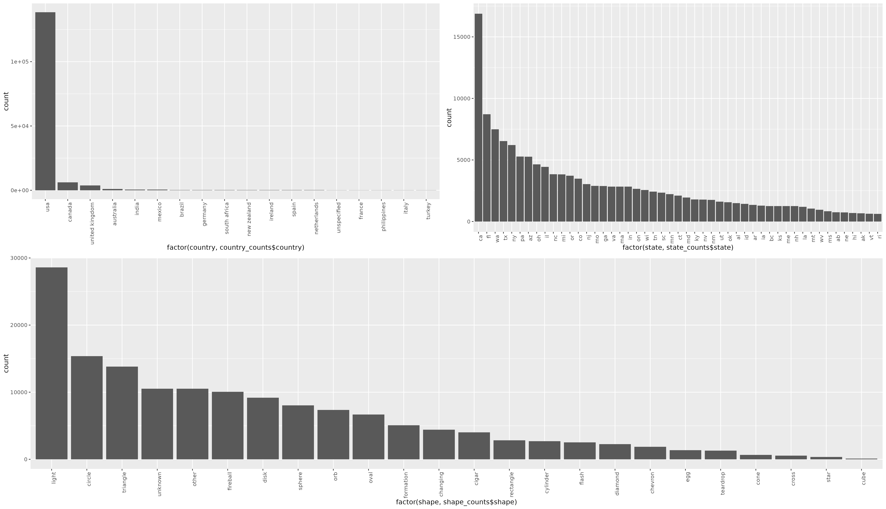

Other Columns
=============

Our other columns are city, state, country and shape.

```R file=basic_exploration.R start="^simplify" end="log.*!"
```



Notes about this code:

We use the `gridExtra` package to make a nice layout for multiple plots. Grid arrange provides the function
`grid.extra` which allows us to combine figures into other figures using whatever numbers of rows and columns we
want. Here we've used it multiple times to create a layout with 2 columns at the top and one on the bottom.

Finally we check some ::03_deduplication:deduplication::.


