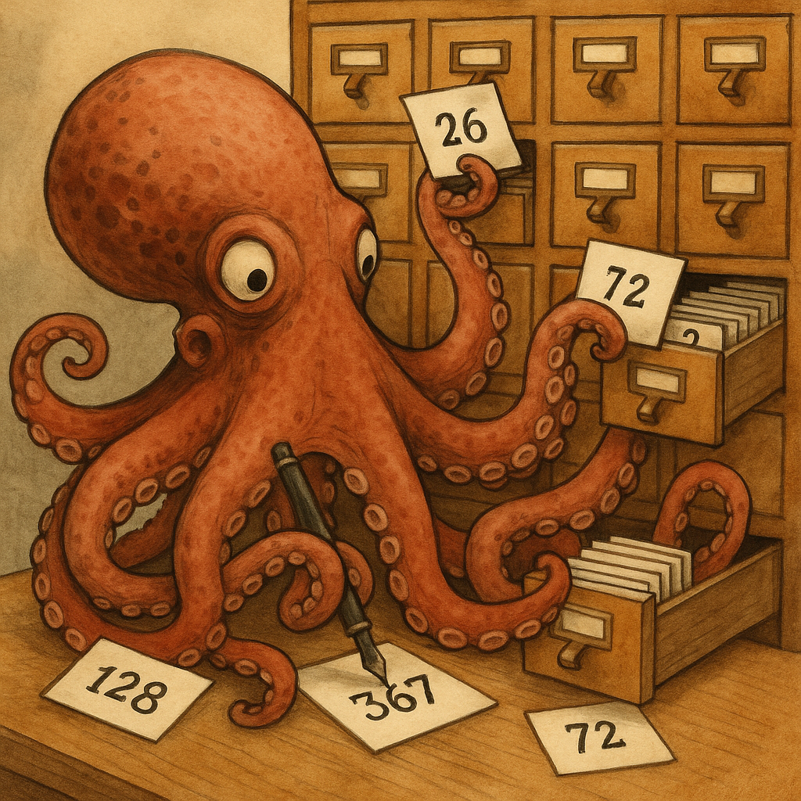

:student-select:Pick a student.; ../students.json::

For an overview, see ::table_of_contents:Table of Contents::

# Introduction to Computers

If you were born after 1990 or so there is a good chance you've never
seen a text-based shell. Modern computers of the most common variety
(smartphones) do an even more aggressive (or successful, depending on
your attitude and needs) job of protecting you from the underlying
operating system. Thus it is worth a brief conceptual review:

A computer, even a smartphone, is a machine with a processor, which
performs mathematical operations on data, memory, which is volatile
storage (it will be erased in the event that the computer is turned off)
which forms the short-term memory of the machine, and non-volatile
storage (disks, solid state memory, even, sometimes still, spinning
rust) which is persistent data store which survives even when the
machine is off.

At the most basic level, a computer reads data from a disk into local
memory and its processor reads a program out of that memory, executing
instructions which modify the data in memory and/or write it back to
long-term storage.

In the early days of computing this was the conceptual world the compute
programmer inhabited as well: interacting with a computer was the
process of telling it, in great detail, which memory to access, what to
do with it, and how to store or output the results.

Since those days the trend has been towards even greater levels of
abstraction. Now, a typical smartphone "protects" the user from most of
these details: you never think explicitly, about the distinctions
between storage and memory or about the details of how programs work.

Next, we’ll build a mental model for languages: ::how_to_understand_computer_languages:How to Understand Computer Languages::
