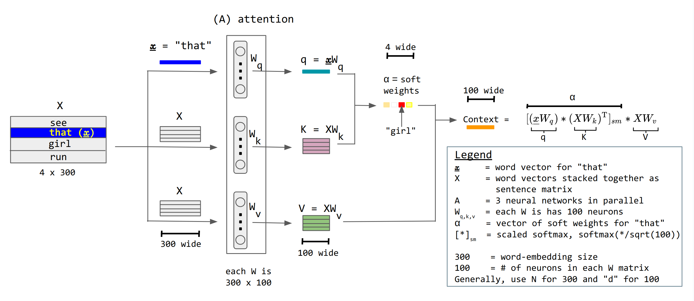

So an interesting thing happens if we increase n even further. Eventually we run out of n-grams. That is to say for each sequence of n words from the text there is only one unique continuation and our model no longer does anything but reproduce the text.

``` R session=lms capture
library(httr)
library(tokenizers)
library(ggplot2)

# Return the maximum frequency among all n-grams of size n
max_ngram_count <- function(words, n) {
  if (length(words) < n) return(0L)
  idx <- seq_len(length(words) - n + 1L)
  grams <- vapply(idx, function(i) paste(words[i:(i + n - 1L)], collapse = " "), character(1))
  tab <- table(grams)
  max(as.integer(tab))
}

# Fetch and tokenize the book (The Night Land)
url <- "https://www.gutenberg.org/cache/epub/10662/pg10662.txt"
txt <- httr::content(httr::GET(url), as = "text", encoding = "UTF-8")
words <- tokenizers::tokenize_words(txt, lowercase = TRUE, strip_punct = TRUE)[[1]]

# Compute max n-gram counts for n = 1..5
ns <- 1:5
max_counts <- sapply(ns, function(n) max_ngram_count(words, n))
df <- data.frame(n = ns, max_count = as.integer(max_counts))

# Plot the relationship
lbdr(ggplot(df, aes(x = n, y = max_count)) +
  geom_line(color = "steelblue") +
  geom_point(color = "steelblue", size = 2) +
  scale_x_continuous(breaks = ns) +
  labs(title = "Most Frequent n-gram Count vs n",
       x = "n-gram size (n)", y = "Max frequency"))
```


A related weakness is that our model can only predict beginning with an n-gram in the text in any case, which limits its ability to generalize. We can add more and more texts to get more and more n-grams but it turns out that at around 5-6 words its very easy to cook up a coherent n-gram which has never been written in any human text ever in history. And even if we could get that data, looking back further and further becomes incredibly expensive. Clearly the Markov chain approach to text generation is inadequate.

Note that we have an exponential die-off in n-gram data which means we need tons of data to have a chance, and even then we'd have problems.

There are two ways to begin to think about a solution.

1. instead of tracking words as part of our state we could just somehow track concepts. That is to say that the further back we go in the history of our text we should represent the word with less and less accuracy. If our current word is cat then when it is 5-words back it might just be "a mammal" and 8 words back "an animal" and 30 words back "a thing". This would tame the combinatorial explosion which makes tracking longer and longer n-grams impossible. But I think you can still see a problem with this - even 30 words back is quite short in a text - its important on page 80 of Alice in Wonderland that the White Rabbit is a White Rabbit, not a "Colored Thing."

2. What if we could somehow intelligently choose which details to pay attention to in the history of the text? That is to say, what if we had a magic function which could take the current state of the model and return just the parts of the text that are relevant to generating the next token? This amounts to having a function which knows how to pay attention to the text contextually.

These two ideas are impossible to implement if we have to specify everything by hand - but it turns out that with enough training data and enough degrees of freedom, neural networks can do an adequate job of looking at an input text and generating a new token.

Although its way outside of the scope of this class, building in this attention architecture and allowing the neural network to learn how to query and represent its own current state, along with huge amounts of data and training time, produced the current revolution in text generating models.



However, its still critical to understand that all these models do is calculate a probability distribution for the next _token_ in a text stream. (Tokens are actualy not words, but parts of words). We then _sample_ from that distribution to generate text, just like a Markov model.

We can actually ::04_using_lms:run language models locally::!
